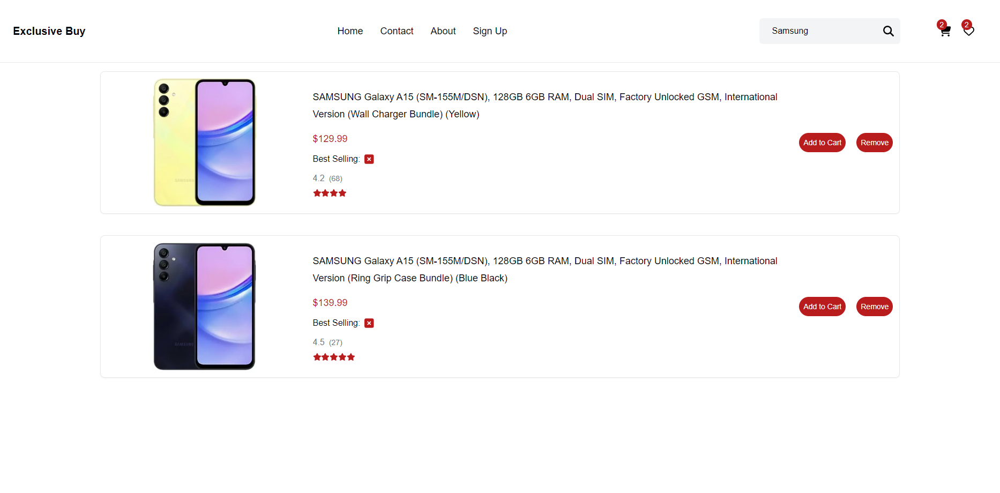

# Exclusive Buy
## [Live Site](https://exclusive-buy.vercel.app)
This is a highly optimized and responsive ecommerce site built with React, Next.js, and Tailwind CSS. The application fetches product data dynamically and features a comprehensive cart and wishlist system, intelligent product search, smooth animations for a visually appealing UI, filtering options on the product search screen, multiple product photos on the product detail page, related products, and a best-seller filter. The project maintains a clean code structure and well-organized file system.

## Features 

- **Highly Optimized Performance:** The application is designed to work efficiently on all systems, ensuring quick load times and smooth user experiences.
- **Responsive Design:** The site is fully responsive, providing a seamless experience across all device sizes, from mobile phones to desktop computers.
- **Cart and Wishlist System:** Users can easily add products to their cart or wishlist, with functionality to view and manage these lists.
- **Intelligent Product Search:** The search system is optimized to provide accurate and fast search results, helping users find products quickly and easily.
- **Smooth Animations:** The site features smooth animations that enhance the user interface, making it more visually appealing.
- **Product Filtering:** The product search screen includes various filtering options, allowing users to narrow down their search based on different criteria.
- **Product Detail Page:** Displays multiple photos of the product and allows users to view them interactively. Related products are also shown to enhance the shopping experience.
- **Best Seller Filter:** Highlights top-selling products, making it easy for users to find popular items.
- **Clean Code and File Structure:** The project follows best practices for coding and file organization, making it easy to maintain and extend.
  
App preview
  
<h3>HomePage</h3>

<h3>Product Detail Page</h3>

<h3>Search Result Page</h3>

<h3>Cart Page</h3>

<h3>Wishlist Page</h3>

## Tech Stack 

- **React:** A JavaScript library for building user interfaces.
- **Next.js:** A React framework for server-side rendering and generating static websites.
- **Tailwind CSS:** A utility-first CSS framework for rapidly building custom user interfaces.
- **Framer Motion:** Using smooth animations for a better UI and alert system.
